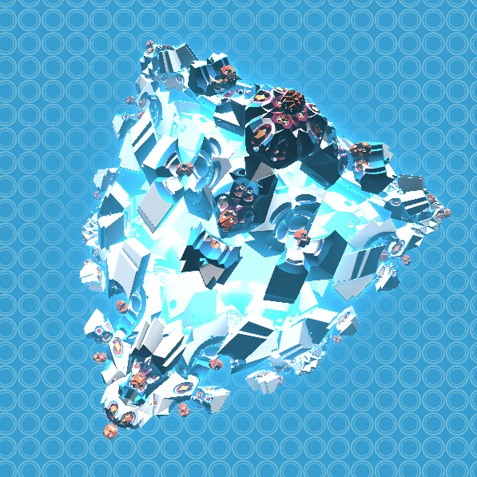

###


# Box Fractal | WebGL Shader Boilerplate

This is my very basic WebGL Frgament Shader boilerplate. It's the bare minimum required to start doing GLSL shader coding.



  

- WebGL2 boilterplate.
- [vertext shader] + [fragment shader] version 300 es.
- Query parameter resolution switching (?rez=1/2/3/4)

## Run the example

Requires Node v10.15.03 or greater

```bash
$ yarn install
$ yarn start
```

open http://localhost:2020/?rez=1 (or rez=2 or 3 for slower systems)
